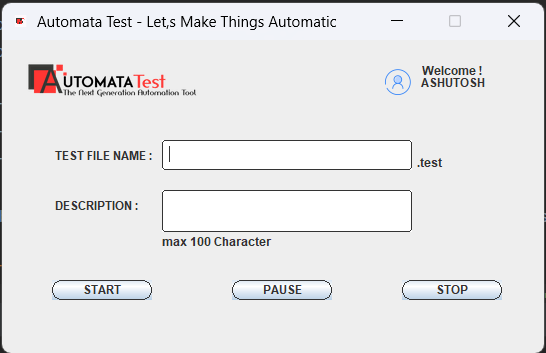
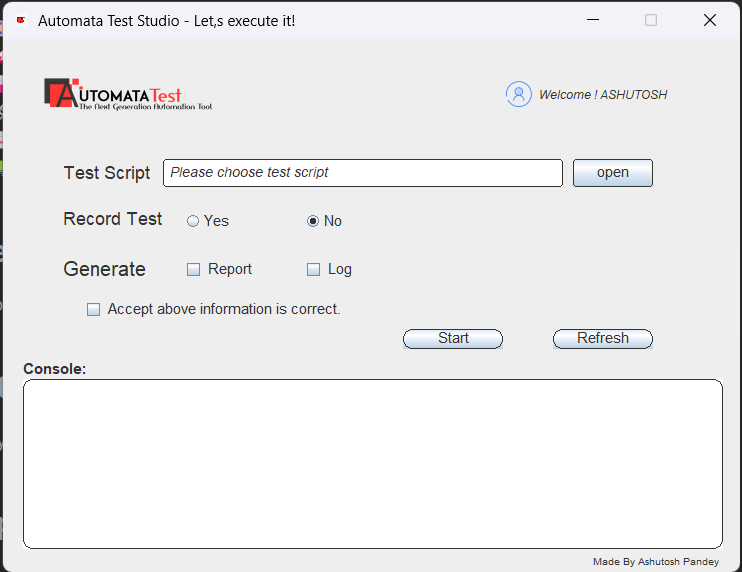

# Automata Test - Let,s Make Things Automatic

Automata Test is your go-to solution for automating desktop testing. This robust application comprises two powerful components: **Automata Deviser** and **Automata Studio**.

## Automata Deviser

Empower your testing team with the intuitive Automata Deviser. Train once and run test infinite scenarios effortlessly, utilizing its features such as:

- 🌟 **User-Friendly Interface:** Seamlessly define and manage test cases.
- 💻 **Scripting Support:** Catering to both novice and advanced users.
- 📂 **Test Scenario Management:** Organize and revisit your test scenarios with ease.

### Getting Started with Automata Deviser

1. 🚀 Open Automata Deviser.
2. 📝 Define a new test scenario or load an existing one.
3. 🛠 Specify the sequence of actions, conditions, and expected outcomes.
4. 💾 Save the test scenario.

## Automata Studio

Elevate your testing experience with Automata Studio - Is an Interpreter for tests generated by Automata deviser . Key features include:

- ⚙️ **Test Execution Platform:** Effortlessly run your test suite.
- 📊 **Real-Time Monitoring:** Witness test progress in real-time.
- 🔗 **Integration Capabilities:** Seamlessly connect with other testing tools and environments.

### Running Tests with Automata Studio

1. 🚀 Open Automata Studio.
2. 🔄 Load the desired test scenario created in Automata Deviser.
3. ▶️ Run the test suite.
4. 📈 Monitor the test execution in real-time.
5. 📊 Review comprehensive test reports.

## Features

- 🎨 Elegant and user-friendly interfaces for both components.
- 🚀 Scripting support for advanced test case definition.
- 📊 Robust reporting and analytics features.
- 🔗 Integration capabilities with other testing tools and environments.
- 📈 Scalability for handling a large number of test cases.
- 📚 Comprehensive documentation for users.

## Created by

This project was created by **Ashutosh Pandey**.

## Getting Started

Ready to streamline your testing process? Dive into the [official documentation](link-to-docs) for a smooth start.

## Support and Feedback

Encountering any challenges or eager to share feedback? [Submit an issue](link-to-issues) on GitHub - we're here to assist!

## License

Automata Test is a proprietary software. All rights reserved and part of permission. Your feedback and collaboration are highly valued.
